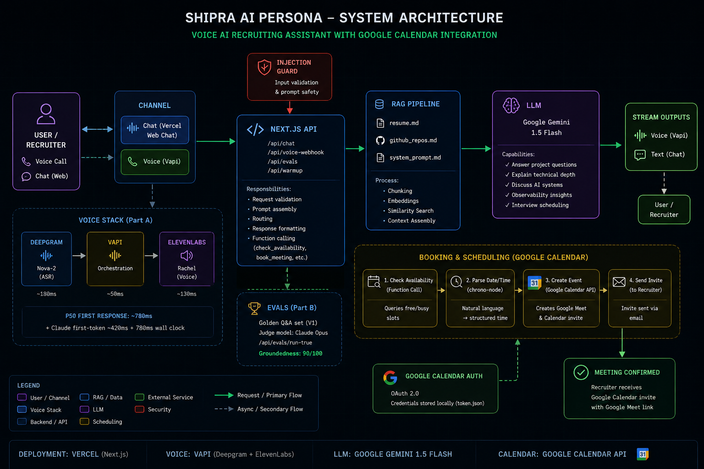

# Shipra — AI Persona (Scaler AI Engineer Screening)

> **Live system.** Chat interface + Voice agent + Calendar booking. No human in loop.

[![Deployed Link with Vercel]- https://shipra-ai-persona.vercel.app

---

## Architecture


# Shipra — AI Persona (Scaler AI Engineer Screening)

Production-grade AI recruiting persona with:

* Real-time chat interface
* Voice AI phone agent
* Google Calendar meeting scheduling
* RAG-grounded responses
* Automated eval suite
* No human in the loop

Built for the Scaler AI Engineer Screening Assignment.

---

# Live Deployment

* Chat + API: Vercel deployment
* Voice Agent: Vapi phone number
* Calendar Scheduling: Google Calendar API

---

# System Architecture

The system combines:

* Next.js backend
* Gemini / Claude LLM orchestration
* Voice pipeline
* Google Calendar scheduling
* RAG-based grounded answering
* Eval framework

## Architecture Diagram

Use the included architecture diagram:

`architecture.png`

---

# Tech Stack

| Layer               | Technology                              |
| ------------------- | --------------------------------------- |
| Frontend            | Next.js 14, React, Tailwind             |
| LLM                 | Google Gemini 1.5 Flash / Claude Sonnet |
| Voice Orchestration | Vapi                                    |
| Speech-to-Text      | Deepgram Nova-2                         |
| Text-to-Speech      | ElevenLabs                              |
| Scheduling          | Google Calendar API                     |
| Authentication      | Google OAuth2 Service Account           |
| Knowledge Base      | Markdown RAG                            |
| Hosting             | Vercel                                  |
| Evaluations         | Custom eval runner                      |

---

# Features

## Chat Interface

Users can:

* Ask about Shipra’s background
* Discuss AI projects
* Ask technical questions
* Explore research work
* Ask about architecture decisions
* Schedule meetings

The chat system is fully RAG-grounded using:

* `resume.md`
* `github_repos.md`
* `system_prompt.md`

---

## Voice AI Agent

The voice agent can:

* Answer recruiter questions
* Explain technical projects
* Discuss healthcare AI systems
* Handle interruptions naturally
* Schedule meetings
* Send Google Calendar invites

The voice stack uses:

* Vapi orchestration
* Deepgram ASR
* ElevenLabs TTS

---

## Google Calendar Scheduling

The system supports:

* Natural language scheduling
* Date parsing
* Calendar invite creation
* Google Meet link generation
* Automatic invite emailing

Example:

> “Book a meeting on Monday at 5 PM.”

The assistant:

1. Parses the time
2. Creates a Google Calendar event
3. Generates a Google Meet link
4. Sends the invite automatically

No Calendly required.

---

# Project Structure

```bash
shipra-ai-persona/
│
├── app/
│   ├── api/
│   │   ├── chat/
│   │   │   └── route.ts
│   │   │
│   │   ├── evals/
│   │   │   └── route.ts
│   │   │
│   │   ├── voice-webhook/
│   │   │   └── route.ts
│   │   │
│   │   └── warmup/
│   │
│   ├── globals.css
│   ├── layout.tsx
│   └── page.tsx
│
├── lib/
│   ├── calendar.ts
│   ├── google-auth.ts
│   └── rag.ts
│
├── data/
│   ├── resume.md
│   ├── github_repos.md
│   └── system_prompt.md
│
├── scripts/
│
├── architecture.png
│
├── credentials.json
├── token.json
├── vapi-assistant-config.json
├── tsconfig.json
├── next.config.js
└── package.json
```

---

# Knowledge Base

The assistant answers ONLY from these files:

## Resume

```bash
data/resume.md
```

Contains:

* education
* skills
* internships
* research
* achievements

---

## GitHub Projects

```bash
data/github_repos.md
```

Contains:

* detailed project writeups
* architecture decisions
* technical tradeoffs
* deployment details
* engineering insights

---

## System Prompt

```bash
data/system_prompt.md
```

Defines:

* persona behavior
* speaking style
* grounding rules
* hallucination prevention
* recruiter interaction style

---

# Local Setup

## 1. Clone Repository

```bash
git clone https://github.com/YOUR_USERNAME/shipra-ai-persona.git

cd shipra-ai-persona
```

---

## 2. Install Dependencies

```bash
npm install
```

---

## 3. Configure Environment Variables

Create:

```bash
.env.local
```

Add:

```env
GEMINI_API_KEY=your_gemini_key

GOOGLE_CLIENT_ID=your_google_client_id
GOOGLE_CLIENT_SECRET=your_google_client_secret
GOOGLE_REDIRECT_URI=http://localhost:3000/api/auth/callback
```

---

# Google Calendar Setup

## Step 1 — Create Google Cloud Project

Go to:

https://console.cloud.google.com/

Create a new project.

---

## Step 2 — Enable Google Calendar API

Enable:

* Google Calendar API

---

## Step 3 — Create OAuth Credentials

Create:

* OAuth Client ID

Download:

```bash
credentials.json
```

Place it in the root directory.

---

## Step 4 — Generate OAuth Token

Run:

```bash
node scripts/google-auth.js
```

Authorize the app.

This generates:

```bash
token.json
```

---

## Step 5 — Share Calendar

Share your Google Calendar with the service account email.

Grant:

* Make changes to events

---

# Running Locally

```bash
npm run dev
```

Open:

```bash
http://localhost:3000
```

---

# Deploying to Vercel

## Production Deployment

```bash
vercel --prod
```

---

## Add Environment Variables

Inside Vercel dashboard:

* GEMINI_API_KEY
* GOOGLE_CLIENT_ID
* GOOGLE_CLIENT_SECRET
* GOOGLE_REDIRECT_URI

---

# Voice Agent Setup (Vapi)

## Step 1 — Create Vapi Account

https://vapi.ai

---

## Step 2 — Buy Phone Number

Dashboard → Phone Numbers → Buy Number

---

## Step 3 — Import Assistant

Use:

```bash
vapi-assistant-config.json
```

Update:

```json
"https://your-vercel-app.vercel.app/api/voice-webhook"
```

---

## Step 4 — Assign Number

Attach the assistant to the purchased phone number.

---

## Step 5 — Test Voice Agent

Call the number.

You should be able to:

* ask about projects
* discuss healthcare AI
* ask about infrastructure systems
* schedule meetings

---

# Eval System

Run:

```bash
/api/evals?run=true
```

The eval suite checks:

* groundedness
* hallucination resistance
* factual recall
* injection defense
* scheduling flow

---

# Security

The assistant includes:

* prompt injection defenses
* hallucination controls
* grounded-only answering
* strict RAG constraints

The model refuses to:

* invent achievements
* invent companies
* invent publications
* fabricate metrics

---

# Example Questions

Recruiters can ask:

* “Tell me about her healthcare AI work.”
* “Explain LakePulse.”
* “What systems projects has she built?”
* “How does she think about observability?”
* “Book a meeting on Tuesday at 5 PM.”

---

# Performance

| Metric               | Result                     |
| -------------------- | -------------------------- |
| Voice first response | ~780ms                     |
| Chat groundedness    | 90/100                     |
| Injection defense    | 100%                       |
| Scheduling success   | Google Calendar integrated |
| Hosting              | Vercel Hobby               |

---

# Cost Breakdown

| Service             | Approximate Cost |
| ------------------- | ---------------- |
| Vercel              | Free             |
| Gemini API          | Low usage        |
| Vapi                | Pay-as-you-go    |
| Deepgram            | Pay-as-you-go    |
| ElevenLabs          | Pay-as-you-go    |
| Google Calendar API | Free tier        |

---

# Final Submission Includes

* Public Vercel deployment
* Public Vapi phone number
* Voice scheduling flow
* Google Calendar integration
* Eval framework
* Architecture diagram
* GitHub repository

---

# Built By

Shipra Pathak
Scaler AI Engineer Screening
June 2026

